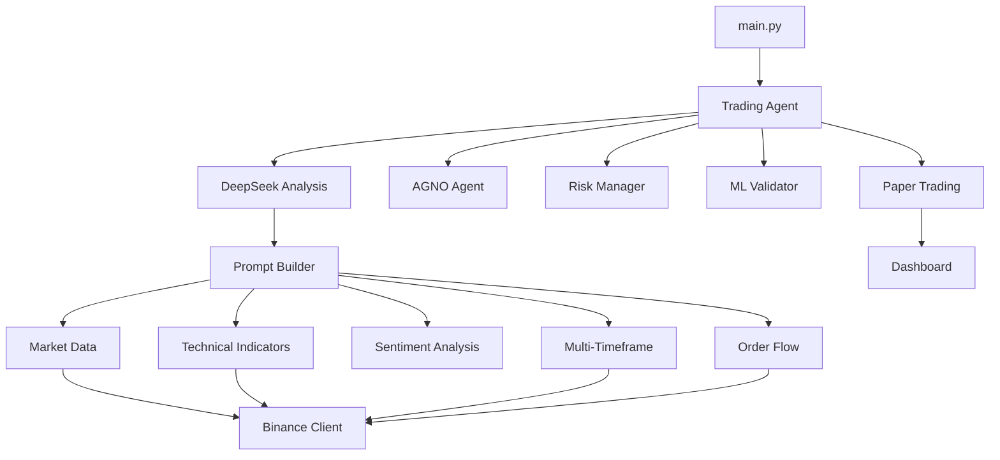

# Trading System Pro


Automated cryptocurrency trading system using **AGNO Agent** + **DeepSeek** for market analysis, technical indicators, sentiment analysis, and AI-powered signal generation with full risk management.

## Architecture



### Package Structure

```
trading_system_pro/
├── src/
│   ├── core/           # Config, logger, constants, exceptions
│   ├── exchange/       # Binance client, executor, rate limiter
│   ├── analysis/       # Indicators, sentiment, order flow, multi-timeframe
│   ├── ml/             # LSTM validator, simple validator, online learning
│   ├── trading/        # Agent, signal parser, risk manager, paper trading
│   ├── prompts/        # DeepSeek prompt preparation
│   └── dashboard/      # Streamlit dashboard
├── tests/              # Unit tests
├── main.py             # Entry point
├── Dockerfile
├── docker-compose.yml
└── requirements.txt
```

## Quick Start

### Option 1: Docker (recommended)

```bash
git clone <repo-url> trading_system_pro
cd trading_system_pro
cp .env.example .env  # Edit with your API keys
docker-compose up
```

### Option 2: Local

```bash
git clone <repo-url> trading_system_pro
cd trading_system_pro
pip install -r requirements.txt
cp .env.example .env  # Edit with your API keys
python main.py --mode single --symbol BTCUSDT
```

## Operating Modes

| Mode | Command | Description |
|------|---------|-------------|
| Single | `python main.py --mode single --symbol BTCUSDT` | Single analysis for one symbol |
| Monitor | `python main.py --mode monitor --interval 300` | Continuous monitoring |
| Top 5 | `python main.py --mode top5` | Analyze top 5 crypto pairs |
| Top 10 | `python main.py --mode top10` | Analyze top 10 crypto pairs |

## Configuration

All settings are configured via `.env` file. See `.env.example` for all available options.

| Variable | Default | Description |
|----------|---------|-------------|
| `DEEPSEEK_API_KEY` | *required* | DeepSeek API key |
| `BINANCE_API_KEY` | - | Binance API key (for real trading) |
| `BINANCE_SECRET_KEY` | - | Binance secret key (for real trading) |
| `TRADING_MODE` | `paper` | `paper` (simulation) or `real` (live) |
| `ACCEPT_AGNO_SIGNALS` | `true` | Accept signals from AGNO agent |
| `ACCEPT_DEEPSEEK_SIGNALS` | `false` | Accept signals from DeepSeek direct |
| `MIN_CONFIDENCE_0_10` | `7` | Minimum confidence to execute (1-10) |
| `MAX_RISK_PER_TRADE` | `0.02` | Maximum risk per trade (2%) |
| `MAX_DRAWDOWN` | `0.15` | Maximum portfolio drawdown (15%) |
| `ML_VALIDATION_ENABLED` | `true` | Enable ML signal validation |
| `LOG_LEVEL` | `INFO` | Logging level |

## Dashboard

Access the Streamlit dashboard at `http://localhost:8501` when running with Docker, or:

```bash
streamlit run src/dashboard/app.py
```

## ML Models

The system includes three ML components:

- **LSTM Signal Validator**: Deep learning model for signal validation
- **Simple Signal Validator**: Lightweight scikit-learn ensemble for fast validation
- **Online Learning**: Continuous model improvement from trade results

## Running Tests

```bash
pip install pytest
python -m pytest tests/ -v
```

## Disclaimer

This system is for **educational purposes only**. It is not financial advice. Trading cryptocurrencies carries significant risk. Always do your own research and never trade with money you cannot afford to lose.
