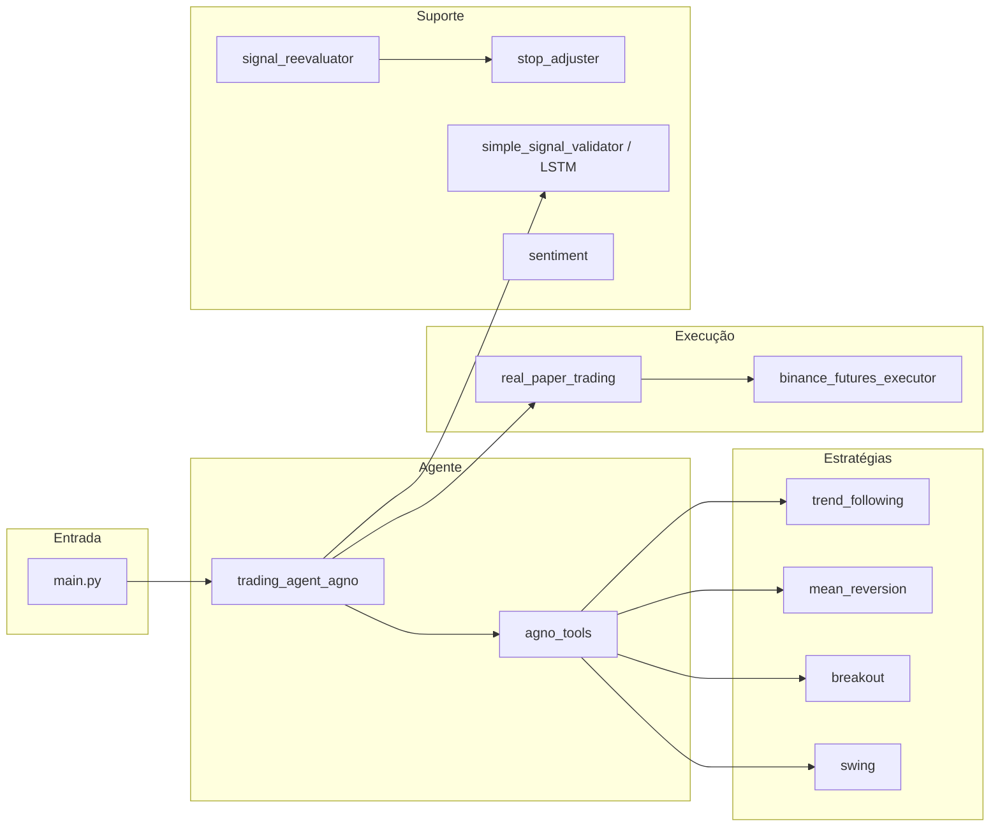

# trading_system_pro

[](https://github.com/YOUR_USER/trading_system_pro/actions/workflows/ci.yml)


Sistema de trading automatizado que usa **AGNO Agent** com **DeepSeek** para orquestrar análises de mercado, indicadores técnicos, sentimento e ML para gerar e reavaliar sinais. Inclui paper trading, reavaliação de posições abertas, ajuste de stop após TP1 e dashboard Streamlit.

---

## Quick Start

```bash
git clone https://github.com/YOUR_USER/trading_system_pro.git
cd trading_system_pro
cp .env.example .env
# Edite .env com DEEPSEEK_API_KEY (e opcionalmente BINANCE_*)
docker-compose up -d
```

Ou sem Docker:

```bash
pip install -r requirements.txt
cp .env.example .env
python main.py --symbol BTCUSDT --mode single
```

---

## Arquitetura (resumo)



- **Entry:** `main.py` — CLI (single / monitor / top10).
- **Orquestração:** `trading_agent_agno.py` + `agno_tools.py`.
- **Estratégias:** `strategies/` (trend_following, mean_reversion, breakout, swing) e filtros em `filters/`.
- **Indicadores:** `indicators/technical.py` (talib) e `constants.py`.
- **Execução:** `real_paper_trading.py`, `binance_futures_executor.py`.
- **Reavaliação:** `signal_reevaluator.py`, `stop_adjuster.py`, `deepseek_client.py`.
- **ML:** `simple_signal_validator.py`, `lstm_signal_validator.py`, `ml_online_learning.py`.
- **Sentiment:** `sentiment/` (LLM + news fetcher).
- **Dashboard:** `streamlit_dashboard.py` (e estrutura em `dashboard/`).

---

## Configuração (.env)

Copie `.env.example` para `.env` e preencha. Principais variáveis:

| Variável | Obrigatório | Descrição |
|----------|-------------|-----------|
| `DEEPSEEK_API_KEY` | Sim (para agent/reevaluator) | API key DeepSeek |
| `BINANCE_API_KEY` | Modo real | API key Binance Futures |
| `BINANCE_SECRET_KEY` | Modo real | Secret key Binance |
| `BINANCE_TESTNET` | Não | `true` para testnet |
| `TRADING_MODE` | Não | `paper` ou `real` |
| `TRADING_SYMBOL` | Não | Ex: BTCUSDT |
| `LOG_LEVEL` | Não | INFO, DEBUG, etc. |
| `OPENAI_API_KEY` | Sentiment LLM | Para análise de sentimento com OpenAI |
| `CRYPTOCOMPARE_API_KEY` | Não | Notícias (opcional) |

Demais opções (risco, reavaliação, ML) estão em `config.py` e podem ser sobrescritas por variáveis de ambiente com o mesmo nome em UPPERCASE.

---

## Estratégias disponíveis

| Estratégia | Descrição | Timeframe sugerido |
|------------|-----------|---------------------|
| trend_following | Tendência com EMA, MACD, ADX, RSI | 4h, 1d |
| mean_reversion | Reversão em extremos RSI/Bollinger | 15m, 1h, 4h |
| breakout | Breakout de níveis (esqueleto) | 1h, 4h |
| swing | Swing com estrutura (esqueleto) | 4h, 1d |

---

## Modelos ML

| Módulo | Uso |
|--------|-----|
| simple_signal_validator | Validação de sinais (RF, GB, MLP, LogReg) |
| lstm_signal_validator | Validação com LSTM |
| ml_online_learning | Retreinamento automático com novos trades |
| sentiment (LLM) | Score de sentimento como feature (opcional) |

---

## Como rodar testes

```bash
pip install -r requirements.txt pytest ruff
ruff check .
python -m pytest tests/ -v
```

*(Crie a pasta `tests/` e testes conforme necessário.)*

---

## Docker

- **Build:** `docker build -t trading_system_pro .`
- **Run bot:** `docker-compose up -d bot`
- **Dashboard:** `docker-compose up -d dashboard` (Streamlit na porta 8501)
- Variáveis via `.env` e volumes para `logs/`, `portfolio/`, `signals/`.

---

## Roadmap

- [ ] Testes unitários e de integração
- [ ] Completar estratégias breakout e swing com lógica do smart_trading_system
- [ ] Integrar streaming Binance e notificações (trader_monitor)
- [ ] Regime optimizer (agente_trade_futuros)
- [ ] Dashboard multi-páginas (overview, backtest, live, ML, signals)

---

## Disclaimer

**Este projeto não é aconselhamento financeiro.** Use por sua conta e risco. Trading de ativos envolve risco de perda. Nunca opere com dinheiro que você não pode perder.

---

## Referências

- [AGNO](https://docs-v1.agno.com/)
- [DeepSeek](https://platform.deepseek.com/)
- [Binance Futures API](https://binance-docs.github.io/apidocs/futures/en/)
